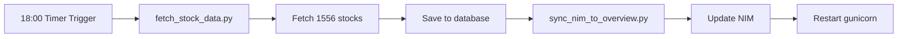

# 🚀 Operations Guide - Vietnam Stock Valuation Platform

**Hướng dẫn vận hành hệ thống cập nhật dữ liệu cổ phiếu tự động**

---

## 📊 Tổng quan hệ thống

### Cơ sở dữ liệu
- **Engine:** SQLite (V3 Schema)
- **Path (VPS):** `/var/www/valuation/stocks.db` (656 MB)
- **Cấu trúc:** 3 bảng chính normalized + 1 bảng overview

### Tự động hóa
- **Service:** `stock-fetch.service` (systemd oneshot)
- **Timer:** `stock-fetch.timer` (hàng ngày 18:00)
- **VPS:** 203.55.176.10 - /var/www/valuation

---

## 🔄 Cập nhật dữ liệu hàng ngày

### 📊 Fetch Flow - Quy trình chi tiết

Khi service chạy (`systemctl start stock-fetch.service`), flow như sau:

#### 1. INPUT
```
📄 symbols.txt → 1,556 mã cổ phiếu (DPP, SDA, CLH, DBT...)
⏱️  --delay 3 → 3 giây delay giữa mỗi stock
```

#### 2. PROCESSING (Mỗi cổ phiếu)
```
[1/1556] Processing VCB...
├─ 🔌 Connect vnstock API (VCI provider)
├─ 📥 Fetch Quarter Ratios
│   ├─ Call: stock.finance.ratio(period='quarter', lang='en')
│   ├─ Returns: DataFrame với ~58 quarters (Q1-2011 → Q4-2025)
│   │   └─ Columns: (Category, Metric)
│   │       • ('Profitability Ratios', 'ROE (%)')
│   │       • ('Valuation Ratios', 'P/E')
│   │       • ('Profitability Ratios', 'NIM (%)') ← Banking only
│   └─ 💾 Save to 3 tables:
│       ├─ stock_ratios_core → 13 metrics
│       ├─ stock_ratios_extended → 13 metrics
│       └─ stock_ratios_banking → NIM (if banking)
├─ 📥 Fetch Year Ratios
│   └─ Same process cho yearly data (~19 years)
└─ ⏸️  Sleep 3s (rate limit prevention)
```

**Rate Limit Handling:**
- Nếu gặp 429 "Too Many Requests" hoặc "sau X giây"
- Auto parse wait time từ error message
- Sleep X+2 seconds
- Retry lại (max 3 lần)

#### 3. DATABASE UPDATES

**stock_ratios_core** (Always populated):
- ROE, ROA, ROIC, Net Profit Margin
- EPS, BVPS, P/E, P/B
- Market Cap, Outstanding Shares
- Financial Leverage

**stock_ratios_extended** (When available):
- Debt/Equity, P/S, P/CF, EV/EBITDA
- Current Ratio, Quick Ratio, Cash Ratio
- Asset Turnover, Inventory Turnover
- Gross/Operating Margin

**stock_ratios_banking** (Banking only - 27 stocks):
- NIM (Net Interest Margin)
- VCB, MBB, ACB, TCB, BID, HDB, LPB, STB, VPB, TPB, etc.

#### 4. POST-PROCESSING

**sync_nim_to_overview.py:**
```sql
UPDATE stock_overview 
SET nim = (
  SELECT nim FROM stock_ratios_banking 
  WHERE symbol = stock_overview.symbol 
  ORDER BY year DESC, quarter DESC LIMIT 1
)
WHERE symbol IN (SELECT DISTINCT symbol FROM stock_ratios_banking)
```
→ Copy latest NIM từ banking table sang overview table (27 records)

**Reload Backend:**
```bash
pkill -HUP gunicorn
```
→ Graceful reload (no downtime), backend đọc data mới từ database

#### 5. RESULTS
```
✅ Success: 1556 stocks
❌ Failed: 0
⏱️  Total time: ~78 minutes (1h 18min)
📊 Total records:
   - stock_ratios_core: 1556 × 77 periods = ~119,812 records
   - stock_ratios_extended: ~119,812 records (sparse)
   - stock_ratios_banking: 27 × 77 = ~2,079 records
   - stock_overview: 1,552 records updated
```

---

### 1. Cập nhật tự động (Systemd)

Service tự động chạy **mỗi ngày lúc 18:00** (sau giờ đóng cửa HOSE 15:00):

**Quy trình tự động:**


**Danh sách cổ phiếu:**
- **1,556 stocks** từ ticker_data.json (HOSE, HNX, UPCOM)
- **Delay:** 3 giây giữa mỗi request (tránh rate limit)
- **Thời gian ước tính:** ~78 phút (~1h 18min)
- **Rate limit handling:** Tự động retry với backoff nếu gặp 429 error

---

### 2. Cập nhật thủ công

#### Cách 1: Chạy service ngay lập tức (Khuyên dùng)
```bash
# Kết nối VPS
ssh root@203.55.176.10

# Chạy service
sudo systemctl start stock-fetch.service

# Xem kết quả (đợi ~15-20 giây)
sudo journalctl -u stock-fetch.service -n 50 --no-pager
```

#### Cách 2: Chạy script trực tiếp
```bash
ssh root@203.55.176.10
cd /var/www/valuation

# Kích hoạt venv
source .venv/bin/activate

# Fetch 19 cổ phiếu chính
python3 scripts/fetch_stock_data.py --symbols VCB MBB ACB --delay 1

# Hoặc fetch 1 cổ phiếu cụ thể
python3 scripts/fetch_stock_data.py --symbols HPG --delay 1

# Fetch toàn bộ 1556 stocks (mất ~78 phút)
python3 scripts/fetch_stock_data.py --file symbols.txt --delay 3

# Sync NIM cho ngân hàng
python3 scripts/sync_nim_to_overview.py

# Restart backend
sudo pkill -HUP gunicorn
```

#### Cách 3: Từ máy local (PowerShell)
```powershell
# Fetch và deploy 1 cổ phiếu
ssh -i C:\Users\PC\Desktop\key.pem root@203.55.176.10 `
  "cd /var/www/valuation && source .venv/bin/activate && python3 scripts/fetch_stock_data.py --symbols VCB --delay 1"
```

---

## 📋 Kiểm tra logs

### 1. Xem logs service
```bash
# Logs gần nhất (50 dòng)
sudo journalctl -u stock-fetch.service -n 50 --no-pager

# Logs theo thời gian thực (live tail)
sudo journalctl -u stock-fetch.service -f

# Logs của lần chạy hôm nay
sudo journalctl -u stock-fetch.service --since today --no-pager

# Logs của lần chạy cuối
sudo journalctl -u stock-fetch.service -n 100 | grep -E "SUCCESS|FAILED|ERROR"
```

### 2. Xem trạng thái timer
```bash
# Kiểm tra timer có đang hoạt động không
sudo systemctl status stock-fetch.timer

# Xem lịch chạy tiếp theo
sudo systemctl list-timers stock-fetch.timer

# Output mẫu:
# NEXT                        LEFT        LAST                        PASSED
# Wed 2026-02-11 18:00:37     22h left    Tue 2026-02-10 20:07:55     5min ago
```

### 3. Đọc logs thành công
Khi service chạy thành công, logs sẽ có dạng:
```
Feb 10 20:07:55 lightnode python3: ✅ VRE: 35 quarterly + 13 yearly records saved
Feb 10 20:07:55 lightnode python3: ✅ Success: 19
Feb 10 20:07:55 lightnode python3: ❌ Failed: 0
Feb 10 20:07:55 lightnode python3: ✅ NIM sync completed: 27 banking stocks updated
Feb 10 20:07:55 lightnode systemd: Finished Stock Financial Data Fetch Service.
Feb 10 20:07:55 lightnode systemd: Consumed 13.795s CPU time.
```

### 4. Đọc logs lỗi
Nếu có lỗi, tìm các dòng chứa:
```bash
# Tìm lỗi
sudo journalctl -u stock-fetch.service | grep -i error

# Xem stack trace
sudo journalctl -u stock-fetch.service -n 200 | grep -A 10 "Traceback"
```

---

## ⚙️ Quản lý service

### Bật/tắt tự động
```bash
# Tắt timer (không tự động chạy nữa)
sudo systemctl stop stock-fetch.timer
sudo systemctl disable stock-fetch.timer

# Bật lại timer
sudo systemctl enable stock-fetch.timer
sudo systemctl start stock-fetch.timer

# Kiểm tra trạng thái
sudo systemctl is-enabled stock-fetch.timer   # enabled/disabled
sudo systemctl is-active stock-fetch.timer    # active/inactive
```

### Thay đổi lịch chạy
```bash
# Sửa file timer
sudo nano /etc/systemd/system/stock-fetch.timer

# Thay đổi dòng OnCalendar (ví dụ: 20:00 thay vì 18:00)
OnCalendar=*-*-* 20:00:00

# Reload và restart
sudo systemctl daemon-reload
sudo systemctl restart stock-fetch.timer
```

### Chạy test không ảnh hưởng timer
```bash
# Chạy service thủ công (không reset timer)
sudo systemctl start stock-fetch.service

# Service sẽ chạy xong và dừng (oneshot)
# Timer vẫn giữ nguyên lịch 18:00 hàng ngày
```

---

## 🗄️ Cấu trúc database

### Stock Overview (Bảng chính API sử dụng)
**1,552 records** - Dữ liệu đã pre-computed
- `symbol`, `exchange`, `industry`
- **Valuation:** pe, pb, ps, ev_ebitda
- **Profitability:** roe, roa, net_profit_margin, gross_margin
- **Financials:** revenue, net_income, total_assets, total_equity
- **Per Share:** eps_ttm, bvps
- **Market:** market_cap, current_price
- **Banking:** nim (Net Interest Margin - chỉ ngân hàng có)

### Stock Ratios Core (13 chỉ số chính)
**65,897 records** - Quarterly/Yearly ratios
- ROE, ROA, EPS, P/E, P/B, EV/EBITDA, Revenue Growth, etc.

### Stock Ratios Extended (13 chỉ số mở rộng)
**65,897 records** - Liquidity & efficiency ratios
- Current Ratio, Quick Ratio, Debt/Equity, Asset Turnover, etc.

### Stock Ratios Banking (NIM)
**1,208 records** - Net Interest Margin cho ngân hàng
- NIM (%) - chỉ số quan trọng nhất của ngân hàng
- 27 mã ngân hàng

---

## 🔧 Troubleshooting

### 1. Service không chạy
```bash
# Xem lỗi chi tiết
sudo journalctl -u stock-fetch.service -n 100 --no-pager

# Kiểm tra file script có tồn tại không
ls -lh /var/www/valuation/scripts/fetch_stock_data.py

# Kiểm tra Python environment
/var/www/valuation/.venv/bin/python3 --version

# Test chạy script trực tiếp
cd /var/www/valuation
source .venv/bin/activate
python3 scripts/fetch_stock_data.py --symbols VCB --delay 1
```

### 2. Timer không trigger service
```bash
# Xem logs của timer
sudo journalctl -u stock-fetch.timer

# Kiểm tra timer có enabled không
sudo systemctl is-enabled stock-fetch.timer

# Restart timer
sudo systemctl restart stock-fetch.timer

# Force trigger ngay (test)
sudo systemctl start stock-fetch.service
```

### 3. Backend không update dữ liệu mới
```bash
# Restart gunicorn
sudo systemctl restart gunicorn

# Hoặc reload (không downtime)
sudo pkill -HUP gunicorn

# Kiểm tra backend đang chạy
sudo systemctl status gunicorn
curl http://localhost:8000/api/market/overview | jq '.data | length'
```

### 4. Database bị lock
```bash
# Kiểm tra process đang dùng database
sudo lsof /var/www/valuation/stocks.db

# Nếu cần, kill process
sudo kill -9 <PID>
```

### 5. API rate limit
Nếu logs có lỗi "429 Too Many Requests" hoặc "sau X giây":
```bash
# Script tự động retry với backoff
# Nhưng nếu vẫn bị limit, tăng delay trong service
sudo nano /etc/systemd/system/stock-fetch.service

# Thay đổi: --delay 3 thành --delay 4 hoặc 5
ExecStart=...fetch_stock_data.py --file symbols.txt --delay 4

# Reload
sudo systemctl daemon-reload
sudo systemctl restart stock-fetch.timer
```

---

## 📁 Các file quan trọng

### Scripts
- **fetch_stock_data.py** - Fetch dữ liệu từ vnstock API (V3 schema, có rate limit handling)
- **sync_nim_to_overview.py** - Sync NIM từ banking table sang overview
- **deploy_database.ps1** - Deploy database từ local lên VPS
- **symbols.txt** - Danh sách 1,556 mã cổ phiếu (generated từ ticker_data.json)

### Systemd
- **/etc/systemd/system/stock-fetch.service** - Service definition
- **/etc/systemd/system/stock-fetch.timer** - Daily timer (18:00)

### Database
- **/var/www/valuation/stocks.db** - Production database (656 MB)
- **Local:** stocks_production.db - Backup local

---

## 💡 Tips & Best Practices

### 1. Khi nào cần fetch thủ công?
- Sau khi thêm cổ phiếu mới vào ticker_data.json
- Khi API có dữ liệu mới (đầu tháng, đầu quý)
- Khi phát hiện dữ liệu sai trên frontend
- **Lưu ý:** Fetch full 1,556 stocks mất ~78 phút, cân nhắc fetch từng nhóm nhỏ

### 2. Monitoring thường xuyên
```bash
# Check timer mỗi tuần (có đang chạy không?)
sudo systemctl status stock-fetch.timer

# Check logs sau mỗi lần tự động chạy (18:00+)
sudo journalctl -u stock-fetch.service --since "18:00" --no-pager | tail -30
```

### 3. Backup database
```bash
# Tạo backup trên VPS
cd /var/www/valuation
cp stocks.db backups/stocks_$(date +%Y%m%d).db

# Download về local
scp root@203.55.176.10:/var/www/valuation/stocks.db ./stocks_backup_$(date +%Y%m%d).db
```

### 4. Mở rộng danh sách cổ phiếu
File `symbols.txt` được tạo tự động từ `frontend-next/public/ticker_data.json`:
```bash
# Local: Regenerate symbols.txt
python automation/generate_symbols_list.py

# Upload lên VPS
scp symbols.txt root@203.55.176.10:/var/www/valuation/

# No need to edit service file (đã dùng --file symbols.txt)
```

---

## 📞 Quick Commands Cheat Sheet

```bash
# === CHẠY UPDATE ===
sudo systemctl start stock-fetch.service         # Fetch ngay

# === XEM LOGS ===
sudo journalctl -u stock-fetch.service -n 50     # 50 dòng cuối
sudo journalctl -u stock-fetch.service -f        # Live tail

# === QUẢN LÝ TIMER ===
sudo systemctl status stock-fetch.timer          # Trạng thái
sudo systemctl list-timers stock-fetch.timer     # Lịch tiếp theo
sudo systemctl restart stock-fetch.timer         # Restart timer

# === RESTART BACKEND ===
sudo pkill -HUP gunicorn                         # Reload (no downtime)
sudo systemctl restart gunicorn                  # Full restart

# === KIỂM TRA DATABASE ===
sqlite3 /var/www/valuation/stocks.db "SELECT COUNT(*) FROM stock_overview;"
sqlite3 /var/www/valuation/stocks.db "SELECT symbol, updated_at FROM stock_overview WHERE symbol='VCB';"

# === TEST API ===
curl http://localhost:8000/api/stock/VCB | jq .
curl http://localhost:8000/api/market/overview | jq '.data | length'
```

---

**Last Updated:** 2026-02-10
**Schema Version:** V3 (Normalized)
**Service:** stock-fetch.service (systemd)

---

## 📐 System Architecture

### Data Flow Diagram

```
┌─────────────────────────────────────────────────────────────┐
│                  AUTOMATED DAILY UPDATE                      │
│                   (18:00 Every Day)                          │
└─────────────────────┬───────────────────────────────────────┘
                      │
                      ▼
              ┌──────────────┐
              │  Timer fires │
              │ stock-fetch  │
              │   .timer     │
              └──────┬───────┘
                     │
                     ▼
         ┌───────────────────────┐
         │  stock-fetch.service  │
         │  (systemd oneshot)    │
         └───────────┬───────────┘
                     │
                     ├─── ExecStart ───────────────────┐
                     │                                  │
                     ▼                                  ▼
         ┌────────────────────────┐      ┌──────────────────────┐
         │ fetch_stock_data.py    │      │   symbols.txt        │
         │ (Python 3.10)          │◄─────│   (1,556 stocks)     │
         └────────────┬───────────┘      └──────────────────────┘
                      │
                      │ Loop: for each stock
                      │
          ┌───────────▼──────────┐
          │   vnstock 3.4.2      │
          │   (VCI Provider)     │
          └───────────┬──────────┘
                      │
          ┌───────────▼──────────────────────┐
          │  API Calls (2 per stock):        │
          │  1. finance.ratio(period=quarter)│
          │  2. finance.ratio(period=year)   │
          └───────────┬──────────────────────┘
                      │
          ┌───────────▼──────────────────────┐
          │    SQLite Database               │
          │    /var/www/valuation/stocks.db  │
          │                                   │
          │  ┌─────────────────────────────┐ │
          │  │ stock_ratios_core           │ │
          │  │ (13 metrics × ~120K records)│ │
          │  └─────────────────────────────┘ │
          │  ┌─────────────────────────────┐ │
          │  │ stock_ratios_extended       │ │
          │  │ (13 metrics × ~120K records)│ │
          │  └─────────────────────────────┘ │
          │  ┌─────────────────────────────┐ │
          │  │ stock_ratios_banking        │ │
          │  │ (NIM × ~2K records)         │ │
          │  └─────────────────────────────┘ │
          └───────────┬──────────────────────┘
                      │
                      │ ExecStartPost (Step 1)
                      │
          ┌───────────▼──────────────────────┐
          │  sync_nim_to_overview.py         │
          │  Copy NIM → stock_overview       │
          │  (27 banking stocks)             │
          └───────────┬──────────────────────┘
                      │
                      │ ExecStartPost (Step 2)
                      │
          ┌───────────▼──────────────────────┐
          │  pkill -HUP gunicorn             │
          │  (Graceful reload backend)       │
          └───────────┬──────────────────────┘
                      │
                      ▼
         ┌────────────────────────┐
         │  Backend Updated       │
         │  API returns new data  │
         └────────────────────────┘
```

### Key Metrics

| Metric | Value | Note |
|--------|-------|------|
| Total Stocks | 1,556 | HOSE + HNX + UPCOM |
| API Calls per Stock | 2 | Quarter + Year ratios |
| Total API Calls | 3,112 | 1,556 × 2 |
| Delay Between Stocks | 3s | Rate limit prevention |
| Estimated Duration | ~78 min | 1,556 × 3s ≈ 1h 18min |
| Database Tables | 3 + 1 | Core + Extended + Banking + Overview |
| Total Records Updated | ~240K | ~120K + ~120K + ~2K |
| Banking Stocks with NIM | 27 | VCB, MBB, ACB, etc. |
| Schema Version | V3 | Normalized (54% smaller) |

### Data Source

**vnstock 3.4.2** (Python package):
- Provider: VCI (Vietnam Capital Investment)
- API: `stock.finance.ratio(period, lang)`
- Returns: MultiIndex DataFrame
  - Columns: `(Category, Metric)`
  - Example: `('Profitability Ratios', 'ROE (%)')` = 18.5
- Rate Limit: ~60 requests/minute
- Language: English field names for consistency

**Data Coverage:**
- Quarterly: Q1-2011 → Q4-2025 (~58 quarters)
- Yearly: 2006 → 2025 (~19 years)
- Total: ~77 periods per stock

**Metrics Categories:**
1. **Profitability:** ROE, ROA, ROIC, Net Margin, NIM
2. **Valuation:** P/E, P/B, P/S, P/CF, EV/EBITDA
3. **Liquidity:** Current Ratio, Quick Ratio, Cash Ratio
4. **Efficiency:** Asset Turnover, Inventory Turnover
5. **Capital Structure:** Debt/Equity, Financial Leverage

---

**Last Updated:** 2026-02-10
**Schema Version:** V3 (Normalized)
**Service:** stock-fetch.service (systemd)
